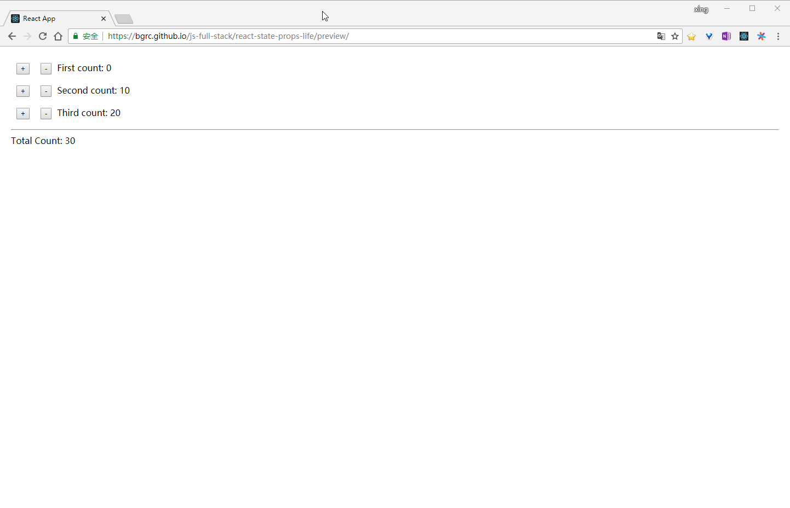
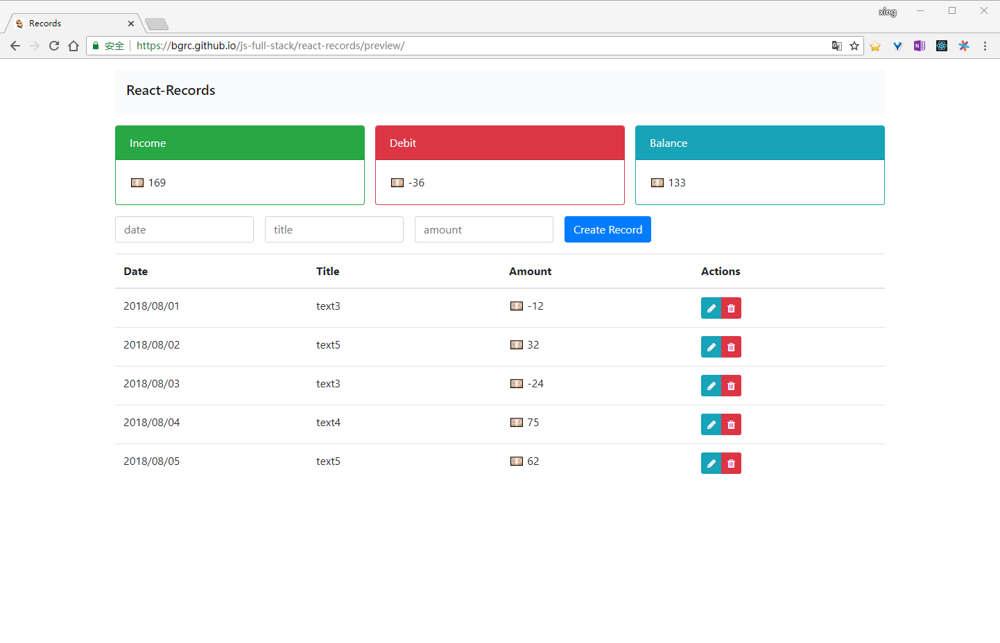
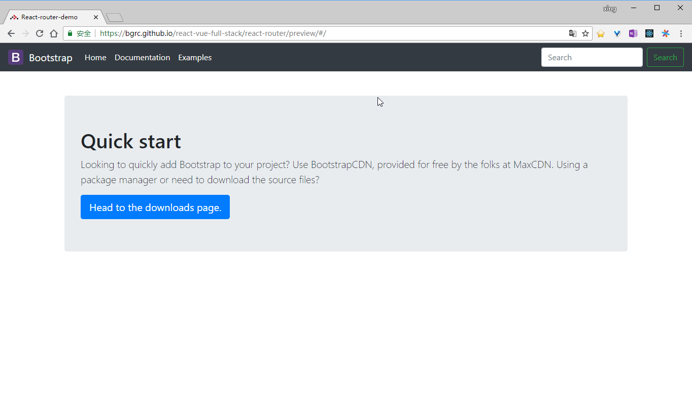

## 目录

- [React 入门之计数器](#demo-1计数器react)

- [使用 React + Axios + MockAPI 进行 CRUD 操作，初步体验前后端分离项目](#demo-2小记账本react--axios--bootstrap-4--font-awesome--mockapi)

- [使用 React-Router 来解决单页面应用中的路由问题](#demo-3react-页面导航react--react-router)

## [Demo 1、计数器（React）](./react-counters)

### 预览

https://bgrc.github.io/react-vue-full-stack/react-counters/preview/

### 要点

- [如何创建一个 React 组件](https://bgrc.fun/posts/react2/#%E5%A6%82%E4%BD%95%E6%B7%BB%E5%8A%A0%E4%B8%80%E4%B8%AA-React-%E7%BB%84%E4%BB%B6)

- [组件之间如何传值](https://bgrc.fun/posts/react2/#React-%E7%BB%84%E4%BB%B6%E4%B9%8B%E9%97%B4%E5%A6%82%E4%BD%95%E4%BC%A0%E9%80%92%E6%95%B0%E6%8D%AE)

- [组件的生命周期](https://bgrc.fun/posts/react2/#React-%E7%BB%84%E4%BB%B6%E7%9A%84%E7%94%9F%E5%91%BD%E5%91%A8%E6%9C%9F)

## [Demo 2、小记账本（React + Axios + Bootstrap 4 + Font Awesome + MockAPI）](./react-records)

### 预览

https://bgrc.github.io/react-vue-full-stack/react-records/preview/

### 要点

- 如何使用 bootstrap 4 的 [sizing](https://getbootstrap.com/docs/4.0/utilities/sizing/) 和 [spacing](https://getbootstrap.com/docs/4.0/utilities/spacing/) 调整容器的位置和大小

- 如何使用 [Font Awesome](./react-records/src/utils/Icons.md) 添加小图标

- 如何使用 [onChange](./react-records/src/components/RecordForm.js#L16-L24) 或 [refs](./react-records/src/components/RecordTable.js#L22-L26) 获取表单数据

- 如何在页面上显示 [Loading 和 Error](./react-records/src/components/Records.js#L93-L107) 状态

- 如何创建 [无状态组件](./react-records/src/components/AmountBox.js#L1-L18)

- 如何使用 [prop-types](./react-records/src/components/RecordTable.js#L109-L114) 进行属性类型检查

- [如何使用 Axios 发送 Ajax，并提取方法到工具类](./react-records/src/utils/RecordsAPI.js#L1-L15)

- 如何提取 [API 地址](./react-records/src/utils/RecordsAPI.js#L3) 到 [环境变量文件](./react-records/.env#L1)

- 如何 [更新](/react-records/src/components/Records.js#L39-L57) 和 [删除](./react-records/src/components/Records.js#L59-L66) 数组中的对象（[参考](https://redux.js.org/recipes/structuringreducers/immutableupdatepatterns#updating-an-item-in-an-array)）

## [Demo 3、React 页面导航（React + React-Router）](./react-records)

### 预览

https://bgrc.github.io/react-vue-full-stack/react-router/preview/

### 要点

- [什么是单页面应用](./react-router/README.md)

- 如何 [配置](./react-router/src/App.js#L12-L19) 组件 [路由](./react-router/src/components/Navbar.js#L17)

- [如何通过 onClick 设置路由](./react-router/src/pages/Documentation.js#L5-L8)

- 了解 [hashHistory 和 browserHistory 的区别](https://github.com/LoeiFy/Recordum/issues/15)